# RingCentral Integration Plan: Approach A (RingCentral Embeddable)

**Project:** Redcliffe CRM  
**Target:** Computer Telephony Integration (CTI) via RingCentral Embeddable  
**Author:** Antigravity / Engineering Team  
**Date:** September 2026  

---

## 1. Executive Summary

This document outlines the technical architecture, implementation phases, and integration workflows to add enterprise telephony into **Redcliffe CRM** using **Approach A: RingCentral Embeddable**. 

RingCentral Embeddable provides a pre-built, cloud-hosted CTI web phone with full WebRTC audio support, call controls, SMS messaging, and call recording capabilities. By integrating this widget into Redcliffe's Angular 17 frontend and Node.js proxy layer via the HTML5 `postMessage` protocol, Redcliffe will achieve native click-to-dial, inbound caller ID screen-pops, and automated CRM call logging with minimal development overhead.

---

## 2. Architecture & Data Flow

```mermaid
sequenceDiagram
    autonumber
    participant Advisor as Advisor / User
    participant Redcliffe as Redcliffe CRM (Angular 17)
    participant CTI as RingCentral Embeddable (IFrame)
    participant RCCloud as RingCentral Cloud Platform
    participant Proxy as Redcliffe Node.js Proxy
    participant SpiceCRM as SpiceCRM / Local DB

    rect rgb(20, 30, 45)
    Note over Redcliffe, CTI: Phase 1: Click-to-Dial
    Advisor->>Redcliffe: Clicks phone number on Account / Contact
    Redcliffe->>CTI: postMessage("rc-adapter-new-call", { phoneNumber })
    CTI->>RCCloud: SIP/WebRTC Dial Request
    RCCloud-->>Advisor: Connects call through headset
    end

    rect rgb(25, 35, 30)
    Note over Redcliffe, CTI: Phase 2: Inbound Screen-Pop
    RCCloud->>CTI: Incoming Call Alert (+1-250-555-0199)
    CTI->>Redcliffe: postMessage("ringcentral-ring", { from: "+12505550199" })
    Redcliffe->>Proxy: GET /api/lookup/phone?number=+12505550199
    Proxy-->>Redcliffe: Match: "Acme Corp" (Account #1042)
    Redcliffe-->>Advisor: Displays Screen-Pop Modal with "Open Account" button
    end

    rect rgb(35, 25, 35)
    Note over Redcliffe, SpiceCRM: Phase 3: Automatic Call Logging
    CTI->>Redcliffe: postMessage("ringcentral-call-ended", { duration: 184, recordingUrl })
    Redcliffe-->>Advisor: Prompts for quick disposition notes
    Redcliffe->>Proxy: POST /api/calls (contact_id, duration, notes)
    Proxy->>SpiceCRM: POST /module/Calls (Create CRM Call Record)
    end
```



---

## 3. Core Features Delivered

| Feature | Description | User Experience |
| :--- | :--- | :--- |
| **Click-to-Dial** | One-click calling on all phone fields across Accounts, Individuals, and Contacts. | Phone numbers become interactive sky-blue pills with a `call` icon. Clicking dials instantly. |
| **Embedded Softphone** | Full WebRTC dialer embedded inside the CRM window. | A floating phone launcher icon in the top header toggles a sleek slide-out dialer drawer. |
| **Inbound Screen-Pop** | Automatic caller matching against CRM accounts and contacts. | Floating alert banner displaying caller name, company, and a button to open their workspace before answering. |
| **Automatic Call Logging** | Records call timestamp, direction (inbound/outbound), duration, and agent notes. | Populates call histories in the Account detail view and pushes a `Call` activity to SpiceCRM. |
| **Two-Way Business SMS** | Direct SMS texting with client plan administrators using company numbers. | Send policy renewal reminders or meeting confirmations directly from the client profile. |

---

## 4. Phased Implementation Roadmap

### Phase 1: RingCentral Developer Setup & Credentials
1. **Developer Portal Registration**:
   - Register a private browser/server app at [developers.ringcentral.com](https://developers.ringcentral.com).
   - App Type: **Browser-Based (SPA)** or **Server/Web**.
   - Primary Permissions:
     - `ReadCallLog` — Access duration, direction, and call timestamps.
     - `CallControl` — Initiate, answer, hold, transfer, and end calls.
     - `WebPhone` — WebRTC browser audio permissions.
     - `SMS` — Two-way client texting.
     - `ReadAccounts` — User profile identification.
2. **Environment Variables**:
   - Add credentials to `backend/.env`:
     ```env
     RC_CLIENT_ID=your_ringcentral_client_id
     RC_CLIENT_SECRET=your_ringcentral_client_secret
     RC_SERVER_URL=https://platform.devtest.ringcentral.com  # or https://platform.ringcentral.com
     RC_REDIRECT_URI=http://localhost:3001/api/auth/ringcentral/callback
     ```

---

### Phase 2: Frontend Embeddable Component (`RingCentralPhoneComponent`)
1. **Widget Loading**:
   - Embed the official RingCentral Embeddable distribution script or iframe adapter:
     ```html
     <iframe
       id="rc-widget-adapter-frame"
       class="rc-widget-iframe"
       allow="microphone; camera; autoplay"
       src="https://ringcentral.github.io/ringcentral-embeddable/app.html?clientId=YOUR_CLIENT_ID&appServer=https://platform.ringcentral.com"
     ></iframe>
     ```
2. **Angular Service (`RingCentralService`)**:
   - Dedicated service managing the `window.addEventListener('message')` message bus.
   - Emits reactive RxJS observables:
     - `callState$` (`ringing`, `connected`, `ended`)
     - `activeCallInfo$` (caller number, duration, call direction)
     - `isWidgetOpen$` (drawer visibility toggle)
3. **Top Navigation Phone Launcher**:
   - Add a phone icon badge in the dashboard top navigation bar displaying connection status (Green = Registered, Amber = Connecting, Grey = Disconnected).

---

### Phase 3: Click-to-Dial Integration across CRM Entities
1. **E.164 Number Normalization**:
   - Utility pipe/helper normalizing input strings (`(250) 555-0199` $\rightarrow$ `+12505550199`).
2. **Interactive Phone Badges**:
   - Update phone displays in:
     - Account Header cards (`phone_office`, `phone_alternate`)
     - Individual / Plan Administrator tables (`phone`, `mobile`)
     - Meeting participant contact cards
3. **Dispatch Handler**:
   - Clicking a phone badge dispatches:
     ```javascript
     window.postMessage({
       type: 'rc-adapter-new-call',
       phoneNumber: normalizedPhone,
       toCall: true
     }, '*');
     ```

---

### Phase 4: Inbound Screen-Pop & Caller Identification
1. **Incoming Call Listener**:
   - Listen for `rc-call-ring-notify` from Embeddable.
2. **Backend Lookup Route (`GET /api/lookup/phone`)**:
   - Searches `accounts` (`phone_office`) and `contacts` (`phone_mobile`, `phone_work`).
   - Returns matched account name, contact name, and account ID.
3. **Screen-Pop UI Banner**:
   - Renders a non-blocking toast/banner at the top-right of the CRM:
     - *"Incoming Call: Jane Smith (ABC Logistics) — +1 (250) 555-0199"*
     - Action button: **"Open Account Workspace"** triggering `selectAccount(account)`.

---

### Phase 5: Automatic Call Logging & History
1. **Call End Listener**:
   - Listen for `rc-call-end-notify` providing call duration, start time, and disposition.
2. **Quick Disposition Modal**:
   - Prompts the advisor:
     - Subject / Call Purpose (e.g. *Renewal Review*, *Claim Inquiry*, *General Question*).
     - Notes textarea.
     - Option to log to Account or Contact.
3. **Backend Proxy Route (`POST /api/calls`)**:
   - Creates a new record in SpiceCRM `/module/Calls` or local store linked to `account_id` or `contact_id`.

---

## 5. Security, CSP, and Audio Permissions

1. **Content Security Policy (CSP)**:
   - Ensure `frontend/src/index.html` permits iframe embedding from RingCentral:
     ```html
     <meta http-equiv="Content-Security-Policy" content="frame-src 'self' https://ringcentral.github.io https://*.ringcentral.com;">
     ```
2. **Browser Feature Policy**:
   - Ensure the iframe tag includes `allow="microphone; autoplay; clipboard-write"` so WebRTC audio works without permission blocks.

---

## 6. Implementation Timeline & Effort

| Phase | Tasks | Estimated Duration |
| :--- | :--- | :--- |
| **Phase 1** | App registration in RingCentral Developer Portal, API keys, and environment configuration. | 0.5 Day |
| **Phase 2** | Embeddable iframe integration in Angular, floating phone drawer component, and message bus. | 1.0 Day |
| **Phase 3** | Click-to-dial normalization and interactive phone buttons across Accounts and Individuals. | 0.5 Day |
| **Phase 4** | Inbound call listener, phone lookup endpoint, and screen-pop alert card. | 1.0 Day |
| **Phase 5** | Call-end event listener, quick disposition modal, and CRM activity call logging. | 1.0 Day |
| **Total** | **Full End-to-End Delivery** | **4.0 Days** |

---

## 7. Next Steps Upon Machine Restart

When you restart your machine and are ready to proceed:
1. Provide your **RingCentral Client ID** (or let us know if you want to use the Sandbox environment to start).
2. We will generate the `RingCentralService` and embedded phone drawer component in `frontend/src/app/components/`.
3. We will enable click-to-dial across all phone fields in the CRM.
