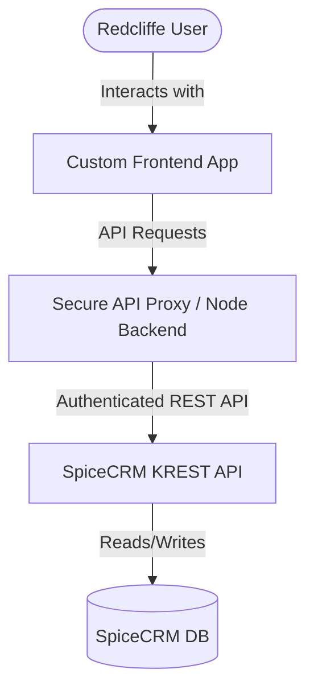

# Redcliffe Sandbox & Environment Documentation

## Project Overview
* **Role**: Head of IT (Insurance Brokerage Company)
* **Goal**: Develop scripts to import data from CSV files and automatically populate it into the SpiceCRM database.
* **Architecture**: The client's CRM is built on SpiceCRM, customized/managed by **ProcessFlow**.
* **Methodology**: Leverage a sandbox clone of the current production application to develop, test, and validate the CSV import scripts.

---

## 1. Droplet Host (Infrastructure)
This DigitalOcean droplet hosts the sandbox instance.

| Detail | Value |
| :--- | :--- |
| **IP Address** | `159.203.57.255` |
| **Username** | `root` |
| **Password** | `E2rakQ%MhY4!1w%h` |

> [!IMPORTANT]
> Password-based root SSH access will be locked down shortly. Ensure you configure SSH key-based authentication as soon as possible.

---

## 2. Application Environments & Credentials

### Live Production
* **App URL**: [https://control.redcliffe.ca/#/login](https://control.redcliffe.ca/#/login)
* **Droplet (VM)**: Hosted on the client's DigitalOcean account (shares a droplet with Dev Staging).

### Staging Environment
* **App URL**: [https://spice.pfcd.ca/#/login](https://spice.pfcd.ca/#/login)
* **Droplet (VM)**: Shares a droplet with Live Production on the client's DigitalOcean account.

### Sandbox Environment
* **App URL**: [https://redcliffeapp-int.pfcd.ca/login](https://redcliffeapp-int.pfcd.ca/login)
* **Droplet (VM)**: Completely separate standalone droplet on the client's DigitalOcean account.

#### Sandbox CRM API / Spice backend
* **Spice URL**: [https://redcliffeapp-int.pfcd.ca/](https://redcliffeapp-int.pfcd.ca/) (or [https://spice.pfcd.ca/](https://spice.pfcd.ca/))
* **Credentials**:
  * **Username**: `pfdev`
  * **Password**: `P5$Tz3R!mQ8V`

#### Sandbox Frontend Users
* **Administrator**:
  * **Username**: `pfdev`
  * **Password**: `P5$Tz3R!mQ8V`
* **Portal User**:
  * **Username**: `testapi`
  * **Password**: `m4#Zr8V!pW6A`
* **Regular User**:
  * **Username**: `test1`
  * **Password**: `X7!qN2@bK9Ls`

---

## 3. Sandbox Database & Domain Architecture

The sandbox environment is completely self-contained within the standalone droplet (`159.203.57.255`). To support testing the custom frontend portal along with the backend CRM, the droplet hosts two virtual hosts and two isolated databases locally.

### Domain & Host Routing
Both sandbox domains resolve to the same single droplet IP address (`159.203.57.255`):
*   **`redcliffeapp-int.pfcd.ca`**: Serves the custom portal application from `/sites/redcliffeapp-int.pfcd.ca/html/public`.
*   **`rspice-int.pfcd.ca`**: Serves the SpiceCRM backend API from `/sites/rspice-int.pfcd.ca/html`.

### Database Separation
Two isolated local MySQL databases run on the droplet:
1.  **`redcliffeapp` Database**: Used by the custom Laravel frontend portal to store portal-specific metadata, web sessions, logs, and portal-only records.
2.  **`redcliffespice` Database**: The core sandbox CRM database containing actual business records (clients, policies, contacts) and CRM user authentication records.

### Authentication Flow
When logging into the sandbox frontend portal (`redcliffeapp-int.pfcd.ca/login`), the portal delegates credential verification to the local SpiceCRM backend (`rspice-int.pfcd.ca`):


> [!NOTE]
> Because authentication is delegated to the CRM backend, user accounts for logging into the portal must be created in the `redcliffespice` database (in the `users` table), not the local `redcliffeapp` database.

---

## 4. Custom Interface Application Architecture

To build a modern, user-friendly UI layer between Redcliffe users and the SpiceCRM application, you can build a custom web app (e.g., using **Next.js**, **React**, or **Vite**).

### Recommended Architecture
To ensure security, performance, and reliability, structure your custom app with a decoupled architecture:



1.  **Frontend Interface**:
    *   A clean, tailored dashboard built using React/Next.js for quick client lookup, policy management, and document uploads.
2.  **API Proxy Layer (Middleware)**:
    *   Deploy a lightweight server middleware (like Next.js API routes or an Express server).
    *   **CORS Management**: Prevents Cross-Origin Resource Sharing (CORS) blocks in the browser by routing requests from your frontend to the proxy, which then calls the SpiceCRM server.
    *   **Security**: Stores sensitive credentials (like API user passwords and token generation secrets) securely on the server-side, rather than exposing them in the client's browser bundle.
3.  **SpiceCRM KREST API Integration**:
    *   Communicate with the backend using REST requests. Do **not** write directly to the database; instead, query and mutate records via the API to trigger automatic workflow rules, validation, audit logs, and data constraints.

### Next Steps for Implementation
*   **Explore API Endpoints**: Navigate to the **API Inspector** inside the SpiceCRM Workbench (`Admin > Workbench > API Inspector`) to review endpoints, filters, and custom modules dynamically.
*   **Establish Authentication**: Set up a test script to authenticate with `/api/data/v1/login` using the regular user credentials and retrieve a session token.

---

## 5. API Testing Script (`spice_test.js`)
A Node.js boilerplate script has been created to test the connection, authenticate, and query records from the sandbox environment.

* **File Path**: [spice_test.js](file:///Users/richardcraven/Documents/REDCLIFFE/spice_test.js)
* **Usage**:
  ```bash
  node spice_test.js
  ```
* **Features**:
  * Uses Node.js native `fetch` (v18+) to run with zero external dependencies.
  * Handles standard POST requests for token generation (`/api/data/v1/login`).
  * Demonstrates GET requests to query the `Accounts` module with limit and field parameters.
  * Includes alternative authentication header examples for legacy KREST implementations.
