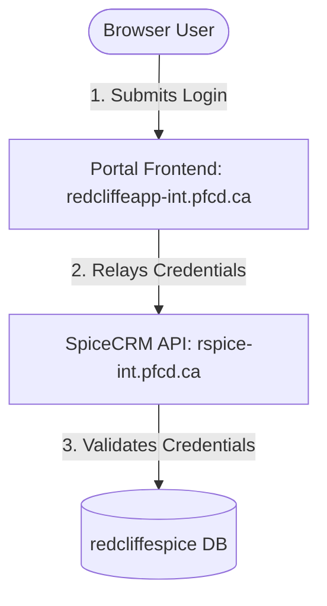
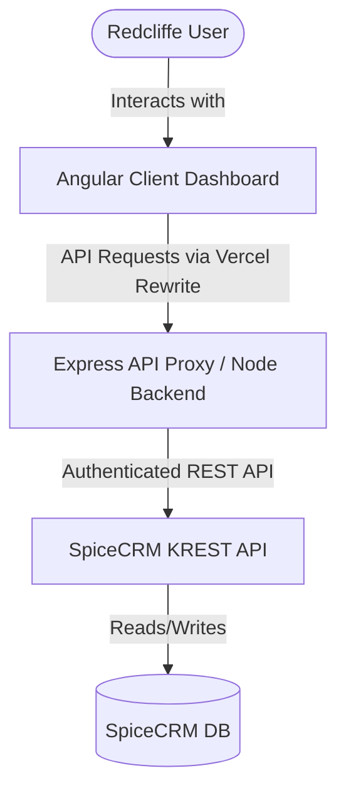

# Redcliffe Sandbox & Environment Documentation

## Project Overview
* **Role**: Head of IT (Insurance Brokerage Company)
* **Goal**: Develop scripts to import data from CSV files and automatically populate it into the SpiceCRM database.
* **Architecture**: The client's CRM is built on SpiceCRM, customized/managed by **ProcessFlow**.
* **Methodology**: Leverage a sandbox clone of the current production application to develop, test, and validate the CSV import scripts.

---

## 1. Droplet Host (Infrastructure)
This DigitalOcean droplet hosts the sandbox instance.

| Detail | Value |
| :--- | :--- |
| **IP Address** | `159.203.57.255` |
| **Username** | `root` |
| **Password** | `E2rakQ%MhY4!1w%h` |

> [!IMPORTANT]
> Password-based root SSH access will be locked down shortly. Ensure you configure SSH key-based authentication as soon as possible.

---

## 2. Application Environments & Credentials

### Live Production
* **App URL**: [https://control.redcliffe.ca/#/login](https://control.redcliffe.ca/#/login)
* **Droplet (VM)**: Hosted on the client's DigitalOcean account (shares a droplet with Dev Staging).

### Staging Environment
* **App URL**: [https://spice.pfcd.ca/#/login](https://spice.pfcd.ca/#/login)
* **Droplet (VM)**: Shares a droplet with Live Production on the client's DigitalOcean account.

### Sandbox Environment
* **App URL**: [https://redcliffeapp-int.pfcd.ca/login](https://redcliffeapp-int.pfcd.ca/login)
* **Droplet (VM)**: Completely separate standalone droplet on the client's DigitalOcean account.

#### Sandbox CRM API / Spice backend
* **Spice URL**: [https://redcliffeapp-int.pfcd.ca/](https://redcliffeapp-int.pfcd.ca/) (or [https://spice.pfcd.ca/](https://spice.pfcd.ca/))
* **Credentials**:
  * **Username**: `pfdev`
  * **Password**: `P5$Tz3R!mQ8V`

#### Sandbox Frontend Users
* **Administrator**:
  * **Username**: `pfdev`
  * **Password**: `P5$Tz3R!mQ8V`
* **Portal User**:
  * **Username**: `testapi`
  * **Password**: `m4#Zr8V!pW6A`
* **Regular User**:
  * **Username**: `test1`
  * **Password**: `X7!qN2@bK9Ls`

---

## 3. Sandbox Database & Domain Architecture

The sandbox environment is completely self-contained within the standalone droplet (`159.203.57.255`). To support testing the custom frontend portal along with the backend CRM, the droplet hosts two virtual hosts and two isolated databases locally.

### Domain & Host Routing
Both sandbox domains resolve to the same single droplet IP address (`159.203.57.255`):
*   **`redcliffeapp-int.pfcd.ca`**: Serves the custom portal application from `/sites/redcliffeapp-int.pfcd.ca/html/public`.
*   **`rspice-int.pfcd.ca`**: Serves the SpiceCRM backend API from `/sites/rspice-int.pfcd.ca/html`.

### Database Separation
Two isolated local MySQL databases run on the droplet:
1.  **`redcliffeapp` Database**: Used by the custom Laravel frontend portal to store portal-specific metadata, web sessions, logs, and portal-only records.
2.  **`redcliffespice` Database**: The core sandbox CRM database containing actual business records (clients, policies, contacts) and CRM user authentication records.

### Authentication Flow
When logging into the sandbox frontend portal (`redcliffeapp-int.pfcd.ca/login`), the portal delegates credential verification to the local SpiceCRM backend (`rspice-int.pfcd.ca`):

> [!NOTE]
> Because authentication is delegated to the CRM backend, user accounts for logging into the portal must be created in the `redcliffespice` database (in the `users` table), not the local `redcliffeapp` database.

---

## 4. Custom Interface Application Architecture

To build a modern, user-friendly UI layer between Redcliffe users and the SpiceCRM application, we built a decoupled web application in a monorepo setup:

1.  **Frontend Interface (`/frontend`)**:
    *   An Angular single-page application (SPA) client featuring a warning modal for bulk operations, a developer console (`Shift + Spacebar`), and a narrowed layout to allow more horizontal room.
2.  **API Proxy Layer (`/backend`)**:
    *   A lightweight Express server hosting endpoints for token state validation (`/api/status`), re-authentication (`/api/reauth`), record fetching (`/api/accounts`), single deletion (`DELETE /api/accounts/:id`), bulk deletion (`POST /api/accounts/delete-all`), and file import (`POST /api/import`).
    *   Protects backend login credentials securely on the server-side, and manages API session tokens dynamically.

---

## 5. Production Deployment Infrastructure

The web application is deployed using a decoupled, production-ready architecture linked to your GitHub repository **`https://github.com/RichardCraven/redcliffe.rct`**:

| Component | Provider | Live URL | Root Directory | Branch |
| :--- | :--- | :--- | :--- | :--- |
| **Frontend (Angular)** | Vercel CDN | *Managed by Vercel* | `frontend` | `main` |
| **Backend (Express)** | Render Web Service | `https://redcliffe-rct.onrender.com` | `backend` | `main` |

### Key Configuration Files:
*   **[angular.json](file:///Users/richardcraven/Documents/Redcliffe/frontend/angular.json)**: Increased stylesheet size limit budget under `anyComponentStyle` (to `40kb`) to allow custom designs.
*   **[vercel.json](file:///Users/richardcraven/Documents/Redcliffe/frontend/vercel.json)**: Manages SPA routing (rewriting URLs to `index.html`) and proxies `/api/*` endpoints to the Render backend URL `https://redcliffe-rct.onrender.com/api/*`.
*   **[crm.service.ts](file:///Users/richardcraven/Documents/Redcliffe/frontend/src/app/services/crm.service.ts)**: Uses dynamic URL resolution to connect to `http://localhost:3001/api` during local development and the relative `/api` route (proxied by Vercel) in production.
