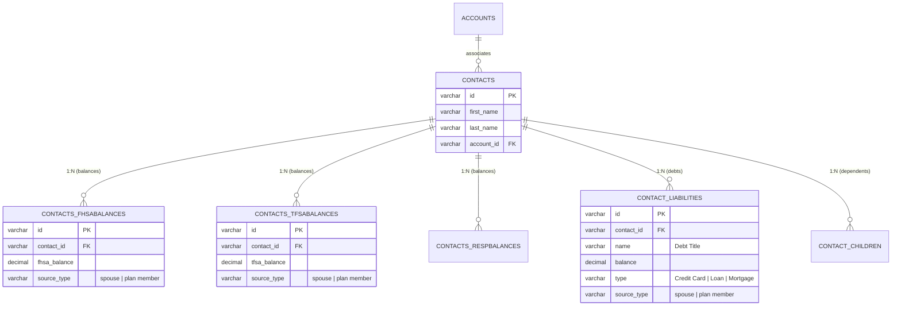

# Redcliffe Financial — CRM Reports Documentation & Catalog

This document provides a comprehensive operational and technical reference for the reporting suite in the **Redcliffe CRM** application and the underlying **SpiceCRM** backend. It explains the financial planning domain model, database relationships, filter criteria, and execution mechanics for all standard reports.

---

## 1. Overview & Business Domain

Redcliffe Financial operates across two primary business verticals:
1. **Corporate Group Benefits & Insurance (Account-Centric)**: Corporate client accounts, policy renewal pipelines, carrier arrangements, employee headcounts, and plan administrator contacts.
2. **Wealth Management & Household Financial Planning (Contact-Centric)**: Individual plan members, spousal assets, registered accounts, liabilities, and dependent children.

To support comprehensive household financial planning, wealth advisors track registered assets and debts separated by role:
- **Plan Member (Primary Client)**
- **Spouse (Partner)**

This separation allows advisors to monitor individual contribution limits, optimize tax sheltering, evaluate household net worth, and prepare for retirement or estate distribution.

---

## 2. Relational Data Model: Wealth Assets & Liabilities

In the CRM database, individual clients live in the `contacts` table. Financial assets, registered savings accounts, and debts are stored in specialized satellite tables linked via 1-to-many relationships:



### Why a Contact May Appear Multiple Times in a Report
Because an individual client or spouse may hold accounts at multiple institutions (e.g., an FHSA at RBC, a second at Wealthsimple, a third at Questrade), the relationship between `contacts` and asset tables is **one-to-many**. 

When a report runs:
- The SQL query performs a join (`contacts` $\leftrightarrow$ `contacts_fhsabalances`).
- **One row is returned per balance entry**.
- A client with 3 registered accounts will show 3 line items, with the Redcliffe KPI cards computing the aggregate sum across all entries.

---

## 3. Canadian Registered Account Vehicle Reference

The CRM tracks several key Canadian tax-sheltered and registered accounts:

| Acronym | Full Name | Purpose & Tax Treatment |
| :--- | :--- | :--- |
| **FHSA** | First Home Savings Account | Tax-deductible contributions with tax-free withdrawals when purchasing a first qualifying home (introduced in Canada in 2023). |
| **TFSA** | Tax-Free Savings Account | Non-deductible contributions with completely tax-free investment growth and withdrawals. |
| **RRSP** | Registered Retirement Savings Plan | Tax-deductible contributions with tax-deferred growth; taxed upon withdrawal in retirement. |
| **RESP** | Registered Education Savings Plan | Tax-sheltered savings vehicle for children's post-secondary education with government grant matching (CESG). |

---

## 4. Complete Report Catalog & Technical Specifications

Below is the complete inventory of reports configured in the system:

### A. Spousal Registered Asset Reports

#### 1. `Contact Spouse FHSA Balance`
* **Target Module**: `Contacts`
* **Joined Relationship**: `contacts_fhsabalances`
* **Filter Logic**:
  ```sql
  WHERE contacts_fhsabalances.source_type = 'spouse'
    AND contacts.deleted = 0
  ```
* **Columns**: `FIRST NAME`, `LAST NAME`, `FHSA BALANCE`
* **Business Usage**: Identifies spouses of plan members who hold active FHSA accounts to ensure household first-home savings room is maximized.

#### 2. `Contact Spouse TFSA Balance`
* **Target Module**: `Contacts`
* **Joined Relationship**: `contacts_tfsabalances`
* **Filter Logic**:
  ```sql
  WHERE contacts_tfsabalances.source_type = 'spouse'
    AND contacts.deleted = 0
  ```
* **Columns**: `FIRST NAME`, `LAST NAME`, `TFSA BALANCE`
* **Business Usage**: Evaluates non-registered vs. tax-free capital allocation for spouses.

#### 3. `Contact Spouse Short-term Liabilities`
* **Target Module**: `Contacts`
* **Joined Relationship**: `contact_liabilities`
* **Filter Logic**:
  ```sql
  WHERE contact_liabilities.source_type = 'spouse'
    AND contacts.deleted = 0
  ```
* **Columns**: `FIRST NAME`, `LAST NAME`, `DEBT TYPE`, `NAME`, `BALANCE`, `INTEREST RATE`, `PAYMENT DETAILS`
* **Business Usage**: Reviews spousal credit lines, personal loans, or high-interest debts during cash-flow planning.

---

### B. Plan Member (Primary Client) Reports

#### 4. `Contact Plan Member FHSA Balance`
* **Target Module**: `Contacts`
* **Joined Relationship**: `contacts_fhsabalances`
* **Filter Logic**:
  ```sql
  WHERE contacts_fhsabalances.source_type = 'plan member'
    AND contacts.deleted = 0
  ```
* **Columns**: `FIRST NAME`, `LAST NAME`, `FHSA BALANCE`
* **Business Usage**: Tracks primary employee/member home savings progress.

#### 5. `Contact Plan Member TFSA Balance`
* **Target Module**: `Contacts`
* **Joined Relationship**: `contacts_tfsabalances`
* **Filter Logic**:
  ```sql
  WHERE contacts_tfsabalances.source_type = 'plan member'
    AND contacts.deleted = 0
  ```
* **Columns**: `FIRST NAME`, `LAST NAME`, `TFSA BALANCE`
* **Business Usage**: Monitors primary member tax-free savings allocations.

#### 6. `Contact Plan Member RESP Balance`
* **Target Module**: `Contacts`
* **Joined Relationship**: `contacts_respbalances`
* **Filter Logic**:
  ```sql
  WHERE contacts_respbalances.source_type = 'plan member'
    AND contacts.deleted = 0
  ```
* **Columns**: `FIRST NAME`, `LAST NAME`, `RESP BALANCE`
* **Business Usage**: Tracks education savings accounts set up for children by the primary plan member.

#### 7. `Contact Plan Member Short-term Liabilities`
* **Target Module**: `Contacts`
* **Joined Relationship**: `contact_liabilities`
* **Filter Logic**:
  ```sql
  WHERE contact_liabilities.source_type = 'plan member'
    AND contacts.deleted = 0
  ```
* **Columns**: `FIRST NAME`, `LAST NAME`, `DEBT TYPE`, `NAME`, `BALANCE`, `INTEREST RATE`, `PAYMENT DETAILS`
* **Business Usage**: Evaluates debt-to-income ratios and outstanding liability balances.

---

### C. Household & Dependent Reports

#### 8. `Contact Children`
* **Target Module**: `Contacts`
* **Joined Relationship**: `contacts_children`
* **Filter Logic**:
  ```sql
  WHERE contacts.deleted = 0
  ```
* **Columns**: `PARENT FIRST NAME`, `PARENT LAST NAME`, `CHILD NAME`, `DATE OF BIRTH`, `AGE`
* **Business Usage**: Identifies dependent children for RESP eligibility, family medical benefit coverage, and estate planning.

#### 9. `Contact Other Noteworthy Assets`
* **Target Module**: `Contacts`
* **Joined Relationship**: `contacts_otherassets`
* **Filter Logic**:
  ```sql
  WHERE contacts.deleted = 0
  ```
* **Columns**: `FIRST NAME`, `LAST NAME`, `ASSET TYPE`, `DESCRIPTION`, `ESTIMATED VALUE`
* **Business Usage**: Tracks non-standard assets such as real estate holdings, private business equity, or vehicle/property valuations.

---

### D. Corporate Account & Group Benefits Reports

#### 10. `*Renewal Pipeline Report`
* **Target Module**: `Accounts`
* **Filter Logic**:
  ```sql
  WHERE accounts.account_type = 'Customer'
    AND accounts.renewal_date IS NOT NULL
  ```
* **Columns**: `ACCOUNT NAME`, `RENEWAL DATE`, `CARRIER/TPA`, `NUM EMPLOYEES`, `STATUS`
* **Business Usage**: The primary pipeline report used by account managers to track upcoming corporate group benefit contract renewals 30, 60, and 90 days out.

#### 11. `*Benefits Only Clients`
* **Target Module**: `Accounts`
* **Filter Logic**:
  ```sql
  WHERE accounts.client_segment = 'Benefits Only'
  ```
* **Columns**: `ACCOUNT NAME`, `INDUSTRY`, `NUM EMPLOYEES`, `ASSIGNED ADVISOR`
* **Business Usage**: Segments corporate accounts that only utilize group health/dental benefits, identifying cross-sell opportunities for group retirement (GRS) or executive pensions.

#### 12. `Accounts with ID for UPDATE Importing`
* **Target Module**: `Accounts`
* **Columns**: `ACCOUNT ID`, `NAME`, `DATE MODIFIED`
* **Business Usage**: Administrative utility report designed for CSV data cleansing, bulk updating, and master spreadsheet reconciliation.

---

## 5. Report Runner Features in Redcliffe App

The Redcliffe custom app includes a dedicated report execution and analysis engine:

1. **One-Click Live Execution**: Clicking **Run** triggers runtime query compilation in SpiceCRM and displays live rows in a full-screen glassmorphic overlay.
2. **Instant Search & Multi-Column Sorting**: Users can search dynamically across all returned columns in real-time or click headers to toggle ascending/descending order.
3. **KPI Stat Cards**:
   - **Total Rows**: Real-time record count.
   - **Numeric Sum & Average**: Automatically identifies dollar balance and count columns to calculate aggregate portfolio sums and mean averages.
4. **Distribution Breakdown Chart**:
   - Renders a CSS/SVG bar chart visualizing category spreads (e.g. balance distribution or status groupings).
5. **Entity Drill-Down**:
   - Clicking an account row within report results immediately opens the account in the main tab manager (`selectAccount()`).
6. **Native CSV Export**:
   - Clicking **Export CSV** streams a pre-formatted `.csv` file directly to the browser for offline accounting or Excel modeling.
