# SpiceCRM Reports (KReports) Architecture & Wiring

This document details the architectural wiring, database schemas, API contracts, and execution workflows for **Reports** in SpiceCRM, as well as how the custom **Redcliffe CRM** application interfaces with the reporting engine.

---

## 1. System Overview

In the SpiceCRM ecosystem, reporting functionality is powered by the integrated **KReporter** framework. Rather than storing static tabular output or rigid SQL scripts, the system operates on a **metadata-driven engine**:
- Report configurations (selected fields, joins, filters, sorting, visualization options) are stored as JSON-encoded blueprints inside a dedicated database table.
- At runtime, the reporting engine parses these blueprints, translates them into optimized multi-table SQL queries against core CRM entities (`accounts`, `contacts`, `meetings`, etc.), and streams the results back to the client.

```mermaid
sequenceDiagram
    autonumber
    participant UI as Client (SpiceUI / Redcliffe App)
    participant Proxy as Express Proxy (/backend)
    participant KREST as SpiceCRM KREST API
    participant DB as MariaDB / MySQL Database

    rect rgb(25, 30, 45)
    Note over UI, DB: Phase 1: Fetching Report Definitions
    UI->>Proxy: GET /api/reports
    Proxy->>KREST: GET /module/KReports?limit=100
    KREST->>DB: SELECT * FROM kreports WHERE deleted = 0
    DB-->>KREST: Returns metadata records (JSON filters/fields)
    KREST-->>Proxy: JSON Array of KReport beans
    Proxy-->>UI: Normalized Report List
    end

    rect rgb(20, 35, 40)
    Note over UI, DB: Phase 2: Report Execution & Data Generation
    UI->>KREST: GET /module/KReports/{id}/execute
    KREST->>DB: Read blueprint from kreports (whereconditions, listfields)
    KREST->>KREST: Compile blueprint into dynamic SQL query
    KREST->>DB: Execute compiled SQL on entity tables (accounts, contacts, etc.)
    DB-->>KREST: Tabular dataset rows
    KREST-->>UI: Rendered grid / chart data
    end
```



---

## 2. Database Schema: The `kreports` Table

In the SpiceCRM database (MariaDB / MySQL), reports do **not** live in a generic settings table. They reside in a dedicated base table:

```sql
kreports
```

*(accompanied by `kreports_cstm` for custom studio fields and `kreports_audit` for revision logging).*

### Core Columns & Data Types

| Column Name | Database Type | Description & Purpose |
| :--- | :--- | :--- |
| `id` | `char(36)` | Unique GUID primary key for the report record. |
| `name` | `varchar(255)` | User-facing display title (e.g. `Renewal Pipeline Report`, `*Benefits Only Clients`). |
| `report_module` | `varchar(50)` | The root entity module the report targets (e.g. `Accounts`, `Contacts`, `Meetings`). |
| `report_status` | `varchar(10)` | Status indicator (`1` = Active, `0` = Inactive). |
| `report_type` | `varchar(25)` | Engine classification (`standard`, `pivot`, `chart`, `dashlet`). |
| `listtype` | `varchar(25)` | Rendering format (`standard`, `grouped`, `tree`). |
| `listfields` | `longtext` (JSON) | Serialized array defining output columns, table aliases, labels, sequence, and formatting. |
| `whereconditions` | `longtext` (JSON) | Serialized array of filtering rules, operators (`equals`, `contains`, etc.), values, and join paths. |
| `wheregroups` | `longtext` (JSON) | Logical groupings (`AND` / `OR` tree) defining precedence between conditions. |
| `presentation_params` | `longtext` (JSON) | Presentation settings (pagination limits, export options, layout plugins). |
| `union_modules` | `text` | Secondary modules joined across union datasets (for multi-module pipelines). |
| `assigned_user_id` | `char(36)` | Foreign key to `users.id` representing report ownership/author. |
| `date_entered` | `datetime` | Creation timestamp. |
| `date_modified` | `datetime` | Last updated timestamp. |
| `deleted` | `tinyint(1)` | Soft-delete flag (`0` = active, `1` = deleted). |

### Real-World Payload Sample

A live record from `kreports` illustrating how fields and conditions are structured:

```json
{
  "id": "6445e28c-4086-3841-5622-d3143291ee60",
  "name": "Contact Plan Member Short-term Liabilities",
  "report_module": "Contacts",
  "report_type": "standard",
  "date_entered": "2025-03-27 16:03:18",
  "date_modified": "2025-03-27 16:03:18",
  "assigned_user_name": { "name": "Administrator" },
  "whereconditions": [
    {
      "fieldid": "kb255c5efc7b8545298a21451a4dee050",
      "path": "root:Contacts::link:Contacts:contact_liabilities::field:source_type",
      "name": "source_type",
      "operator": "equals",
      "value": "plan member"
    }
  ],
  "listfields": [
    { "fieldname": "first_name", "sequence": 0, "display": "yes" },
    { "fieldname": "last_name", "sequence": 1, "display": "yes" },
    { "fieldname": "type", "sequence": 2, "display": "yes" },
    { "fieldname": "balance", "sequence": 4, "display": "yes" }
  ]
}
```

---

## 3. Production Frontend Wiring (`control.redcliffe.ca`)

The production SpiceCRM frontend (built on Angular and the Lightning Design System) maps routes directly to underlying modules:

1. **Route URL**: `control.redcliffe.ca/#/module/KReports`
2. **Component Lifecycle**:
   - The route activator resolves the `KReports` module metadata.
   - The list view component issues a paginated query to the KREST API:
     ```http
     GET /api/module/KReports?limit=25&offset=0&sort=name:ASC
     ```
3. **Execution Trigger**:
   - Clicking a report row navigates to `#/module/KReports/<id>`.
   - The view component requests the executed result dataset from the backend execution endpoint:
     ```http
     GET /api/module/KReports/<id>/execute
     ```
   - The backend runs the compiled SQL query against live business data (`accounts`, `contacts`, etc.) and streams the data array to the frontend datatable.

---

## 4. Redcliffe Custom App Proxy Integration

The Redcliffe custom application (`/Users/richardcraven/Documents/Redcliffe`) interacts with SpiceCRM reports through its dedicated Node/Express proxy layer.

### 1. Backend Proxy Routes (`backend/server.js`)

#### Fetch All Reports (`GET /api/reports`)
```javascript
app.get('/api/reports', ensureUserSession, ensureAuthenticated, async (req, res) => {
  const limit = req.query.limit || 100;
  try {
    const response = await fetch(`${spiceCrmUrl}/module/KReports?limit=${limit}`, {
      method: 'GET',
      headers: {
        'OAuth-Token': sessionToken,
        'Accept': 'application/json'
      }
    });
    // Automatic 401 token refresh retry included
    const data = await response.json();
    res.json(data);
  } catch (error) {
    res.status(500).json({ error: error.message });
  }
});
```

#### Delete Report (`DELETE /api/reports/:id`)
```javascript
app.delete('/api/reports/:id', ensureUserSession, ensureAuthenticated, async (req, res) => {
  const { id } = req.params;
  const response = await fetch(`${spiceCrmUrl}/module/KReports/${id}`, {
    method: 'DELETE',
    headers: {
      'OAuth-Token': sessionToken,
      'Accept': 'application/json'
    }
  });
  ...
});
```

### 2. Frontend CRM Service (`frontend/src/app/services/crm.service.ts`)

In the custom Angular frontend, reports are consumed through reactive RxJS observables:

```typescript
// Fetch report definitions from proxy
getReports(limit: number = 100): Observable<any> {
  return this.http.get<any>(`${this.apiUrl}/reports?limit=${limit}`);
}

// Delete a report
deleteReport(id: string): Observable<any> {
  return this.http.delete<any>(`${this.apiUrl}/reports/${id}`);
}
```

---

## 5. Distinction: Report Metadata vs. Business Data

It is critical to distinguish between where report **definitions** live versus where report **data** comes from:

| Category | Storage Location | Examples |
| :--- | :--- | :--- |
| **Report Blueprints** | `kreports` table | Report Name, Columns to show (`listfields`), Filters (`whereconditions`), Groups (`wheregroups`). |
| **Transactional Data** | Core Business tables | `accounts`, `contacts`, `meetings`, `opportunities`, `calls`. |
| **Junction Relationships** | Core Link tables | `accounts_contacts`, `meetings_contacts`, `accounts_opportunities`. |
| **Custom Field Data** | `*_cstm` tables | `accounts_cstm`, `contacts_cstm`, `kreports_cstm`. |

When a report is deleted via `DELETE /api/reports/:id`, only the record in the **`kreports`** table is marked deleted (`deleted = 1`). **None** of the underlying client accounts or contacts queried by that report are affected.
