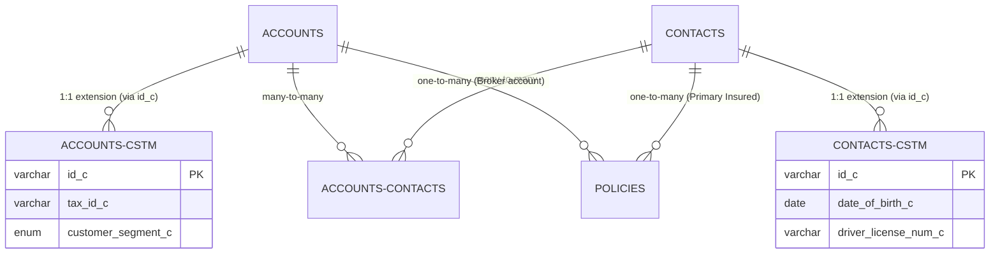

# SpiceCRM Onboarding & API Integration Guide
*Tailored for Onboarding Admins & Developers in Insurance Brokerage*

This document outlines key administrative, database, and API concepts to help you onboard client data into SpiceCRM and prepare for building a custom, streamlined interface layer.

---

## 1. Onboarding Admin Overview (Insurance Broker Context)

As an Onboarding Admin for an insurance broker company, your primary focus is structuring the CRM to reflect the relationship between clients, policies, carriers, and claims. 

### Core Module Mapping
In a typical insurance brokerage, standard SpiceCRM modules map to your domain as follows:

| Standard Module | Insurance Domain Mapping | Key Fields to Track |
| :--- | :--- | :--- |
| **Accounts** | Households / Corporate Clients | Business Name, EIN, Billing/Mailing Addresses, Industry. |
| **Contacts** | Policyholders / Insured Individuals | Name, SSN/DoB, Email, Phone, Family Relationships, Driver License #. |
| **Opportunities** | Policy Prospects / Pipelines | LOB (Line of Business), Expected Close Date, Estimated Premium. |
| **Policies / Contracts** *(Custom)* | Active/Expired Insurance Policies | Policy Number, Carrier ID, Premium, Commission, Effective/Expiration Dates, Status. |
| **Claims** *(Custom)* | Claim Filings | Date of Loss, Claim Number, Deductible, Claim Status, Adjuster Details. |
| **Quotes** *(Custom)* | Underwriting Offers | Carrier Name, Coverage Limits, Premium Options, Expiry Date. |

> [!NOTE]
> SpiceCRM is highly modular. If "Policies" or "Claims" modules do not exist in your default installation, they are typically configured as custom modules via the **Dictionary Manager** or code-level Vardefs.

---

## 2. Database & Schema Architecture

SpiceCRM's database architecture is metadata-driven, derived from the classic SugarCRM/SuiteCRM foundation but enhanced with modern administration tools.

### Core Tables vs. Custom Tables
To keep the core database upgradeable, SpiceCRM separates standard fields from custom fields:
*   **Base Tables (e.g., `contacts`, `accounts`):** Store standard fields (e.g., `id`, `name`, `date_entered`, `assigned_user_id`).
*   **Custom Tables (e.g., `contacts_cstm`, `accounts_cstm`):** Automatically generated to store custom fields defined through the UI or metadata. They map 1:1 using the record's UUID (`id_c`).
*   **Junction Tables (e.g., `accounts_contacts`):** Store relationships between tables. Many-to-many relationships use a middle table with columns like `account_id` and `contact_id`.



### Schema Extensions (Vardefs)
All database structures are defined in PHP files called **Vardefs** (Variable Definitions). When you add a field:
1. A Vardef extension is created at `custom/Extension/modules/<Module>/Ext/Vardefs/<field_name>.php`.
2. Running a **Quick Repair and Rebuild** (in Admin panel) compiles these extensions and generates the SQL statements (`ALTER TABLE ...`) required to modify the database.

---

## 3. Interfacing via the SpiceCRM KREST API

To build a custom frontend (e.g., a sleek mobile app or simplified customer portal), you will communicate with SpiceCRM using its REST API, historically named **KREST**.

### Accessing the API Inspector
> [!IMPORTANT]
> The single best resource for your specific setup is the **API Inspector** located inside the **SpiceCRM Workbench** (`Admin > Workbench > API Inspector`). It dynamically reads all custom modules/fields and provides interactive endpoints you can test in real-time.

### Authentication
Typically, you authenticate by posting credentials to retrieve a session ID (token). This session token is then passed in the headers of all subsequent API calls.

*   **Endpoint:** `POST /api/data/v1/login` (or `/KREST/login` depending on version)
*   **Headers:** `Content-Type: application/json`
*   **Payload:**
    ```json
    {
      "username": "api_user",
      "password": "api_password"
    }
    ```
*   **Response:** Returns a token (often `session_id`) that you include as a Header: `Authorization: Bearer <session_id>` or in the request cookie.

---

## 4. Key CRUD Operations for Client & Policy Data

Here is how your custom interface layer will interact with CRM data.

### Retrieving Clients (GET)
To list clients (Accounts or Contacts) with search filters, sorting, and pagination:
*   **Endpoint:** `GET /api/data/v1/module/Accounts`
*   **Query Parameters:**
    *   `searchterm`: Search name or address fields (e.g., `John Doe`).
    *   `limit`: Number of records to return (e.g., `20`).
    *   `offset`: For pagination.
    *   `fields`: Specify only the fields you need to fetch (crucial for lightweight apps).
*   **Example Request URL:**  
    `GET /api/data/v1/module/Accounts?searchterm=Acme&limit=5&fields=id,name,phone_office,billing_address_city`

### Creating a New Client / Policy (POST)
To register a new policy or client contact:
*   **Endpoint:** `POST /api/data/v1/module/Contacts`
*   **Headers:**
    ```http
    Content-Type: application/json
    Authorization: Bearer <your_session_token>
    ```
*   **Payload:**
    ```json
    {
      "first_name": "Sarah",
      "last_name": "Connor",
      "email1": "sarah.connor@example.com",
      "phone_mobile": "555-0199",
      "date_of_birth_c": "1965-11-10"
    }
    ```

### Linking Records (Relationships)
If you need to link a newly created Client to a Policy, use relationship endpoints.
*   **Endpoint Pattern:** `POST /api/data/v1/module/<ParentModule>/<parentId>/related/<relationshipName>`
*   **Example (Linking Contact to Policy):**  
    `POST /api/data/v1/module/Policies/POL-982312/related/contacts`
*   **Payload:**
    ```json
    {
      "id": "CON-839210"
    }
    ```

---

## 5. Integration Strategy for Your Custom App

When designing your lightweight portal/interface:

1.  **CORS & Proxying:** To prevent Cross-Origin Resource Sharing (CORS) errors in browser-based apps, run a thin Node.js or Next.js backend proxy. Your frontend talks to your proxy, and your proxy securely relays calls to the SpiceCRM KREST API (using cached API keys).
2.  **Fieldsets & Views:** Use SpiceCRM's **Fieldset Manager** within the Workbench to group client fields logically. This metadata can be consumed dynamically by your application to build forms on the fly.
3.  **Data Sync vs. Real-Time:** 
    *   *Real-time API:* Recommended for customer portals where users view their own active policies and update contact details.
    *   *Direct Database Read:* Only use read-only replicas for heavy reporting or complex data syncs. Never write directly to the database bypass-ing the REST API, as doing so skips crucial CRM business logic, audit logs, and workflow triggers.
